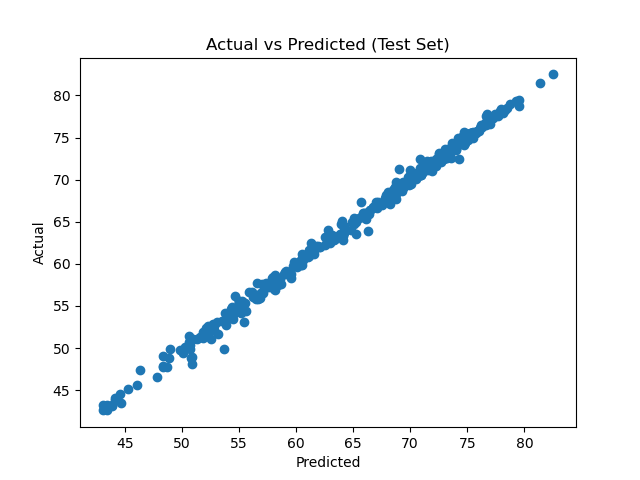
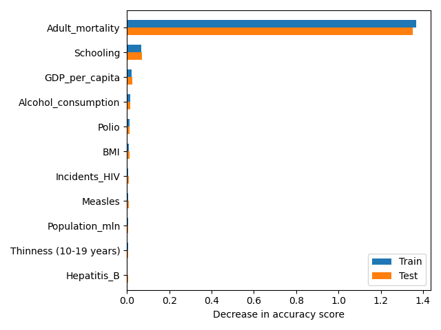
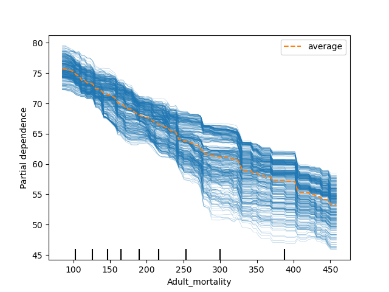
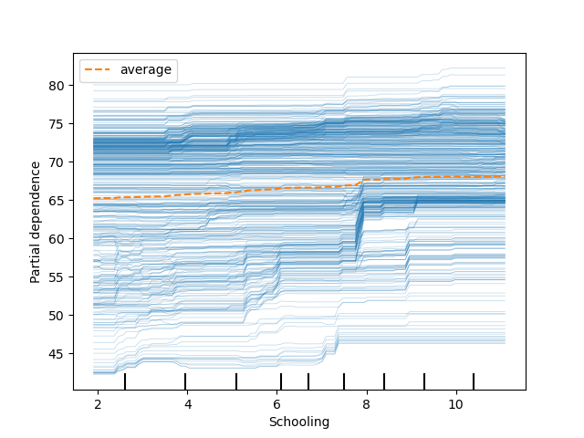
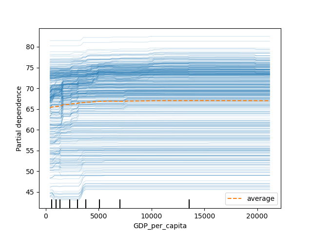
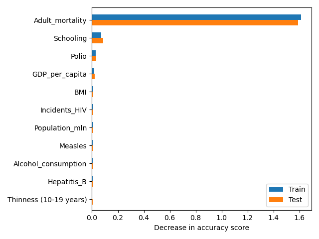
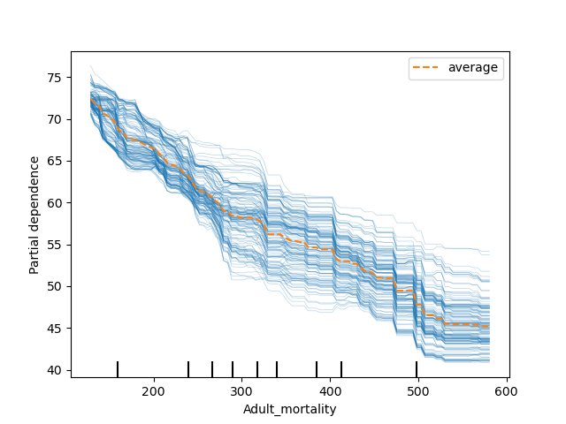
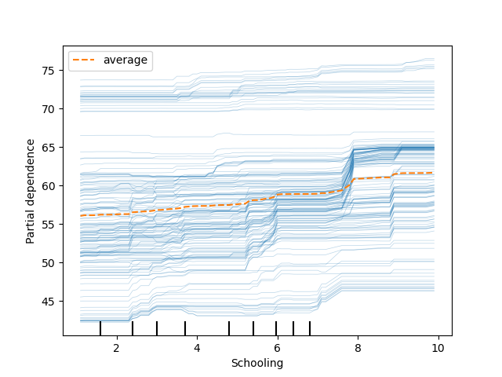
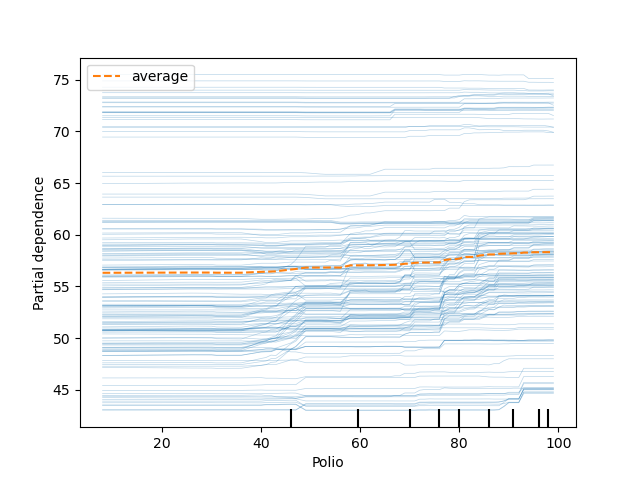

# Model Card
Life expectancy is defined as the average number of years a person can expect to live based on current mortality rates. This model predicts life expectancy for **developing** countries based on a number of other key health and economic indicators.

## Overview

**Developer:** This model was constructed in a private capacity.

**Intended Usage:** This model is intended for research purposes and should not be used for policymaking without further investigation into accuracy and potential biases.

**Training and Testing data** The model was trained on a dataset available in Kaggle: [Life Expectancy (WHO) Fixed](https://www.kaggle.com/datasets/lashagoch/life-expectancy-who-updated). This was based on primary data sources from _WHO_, _World Bank_, and _Our World in Data_. More details on the data set can be found in [Data_Sheet.md](Data_Sheet.md). For the purposes of assessing the model performance 80% of the data was used for training and 20% for testing. 

## Model Description

**Input:** 
The inputs are a number of different health and population indicators. These are described in more detail in [Data_Sheet.md](Data_Sheet.md).

**Output:**
The model output is the prediction for the life expectancy.

**Model Architecture:** 
The model uses version 2.1.1 of the [XGBoost](https://xgboost.readthedocs.io/en/stable/get_started.html) library with the following parameters:

- Learning Parameter, eta: 0.1
- Maximum depth of the tree, max_depth: 10

## Performance
The model was assessed using the following metrics:

- Mean squared error
- Mean absolute error
- Mean absolute percentage error
- Maximum Error, $`\max_i |X^{(i)}_{predict} - X^{(i)}_{actual}|`$
- $`R^2`$ Score, [Coefficient of determination](https://en.wikipedia.org/wiki/Coefficient_of_determination) 

Calibrating the model using 20\% of the data sample gave the following performance:

- Mean squared error: 0.322
- Mean absolute error: 0.374
- Mean Absolute Percentage Error: 0.006
- Maximum Error: 3.780
- $`R^2`$ Score: 0.996
- Training Time: 282 ms
- Prediction Time: 3 ms

## Generalisation
The permutation importance of the main features was very similar between the training and test sets indicating good generalisation.

## Limitations & Bias
The model should only be used for developing countries. It has been tested on annual data from a number of different developing countries over a period from 2000-2015. This covered a number of natural disasters however it may not be appropriate outside this context.

# Model Results
In this section we include some model results as they give further insight into the generalisability of the model and the features impacting the life expectancy.

XGBoost is an ensemble method which is generally less interpretable than a simple decision tree. We use two inspection methods to understand the impact of features on the training and test sets:

- **Permutation Importance:** This shows the decrease in the performance (mean squared error) if a single feature is randomised. This gives insight into the factors driving the training and test performance. A model which is generalising properly, and not overfitting to the training set, should have a similar level of  feature importance for both the training and test sets.

- **Dependency analysis:** We used [Partial dependence and individual conditional expectation plots](https://scikit-learn.org/stable/modules/partial_dependence.html) to understand how the life expectancy predictions for the test set depended on the most important features. Partial dependency plots show the average impact across the test set. The individual conditional expectation plot shows the impact on each individual element of the test set. 

In the below the fine blue lines correspond to the individual conditional expectation plot and the orange lines, marked average, are the partial dependency plot. 

## All Developing Countries
### Permutation Importance

These results show that the drivers are extremely similar between the training and test sets indicating the model is generalising correctly and not simply overfitting to the training set.

### Dependency analysis

#### Adult mortality

Increased levels of adult mortality are associated with lower life expectancy both on average and across all samples.
#### Schooling

Increased levels of schools lead to high life expectancy with almost complete uniformity 
#### GDP per capita

## African Countries:
All African countries are classes as developing during the period 2000-2015.

### Permutation Importance

### Dependency analysis
#### Adult mortality

#### Schooling

#### Polio

